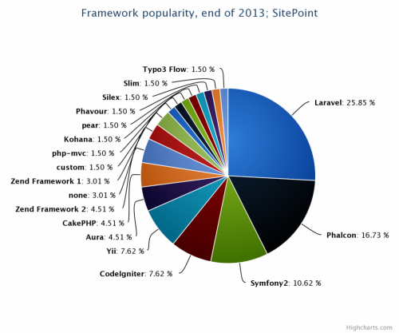
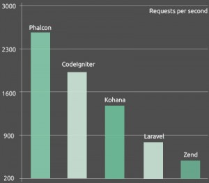
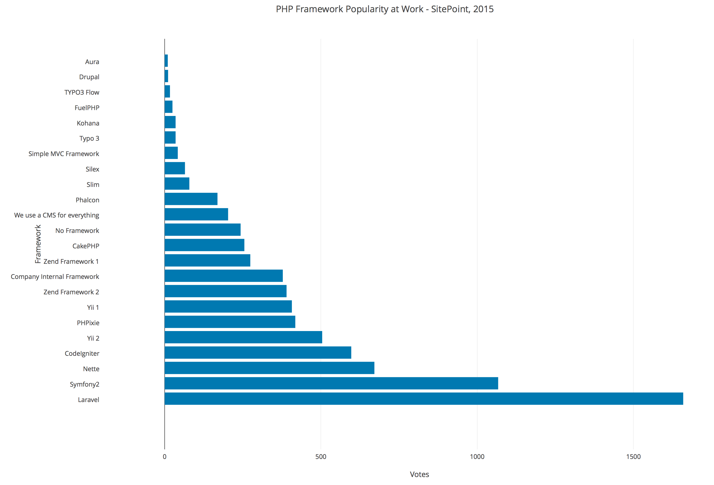

> php框架, 完全没有概念哈.

### 框架简介

Sitepoint网站做了一个小的调查，看看PHP开发者们最喜欢使用哪个PHP框架。调查结果显示，最流行的PHP框架前三甲为：Laravel、Phalcon、Symfony2。

使用Phalcon作为主力框架，主要源于其在稳健性和质量方面的优秀表现，事实上Phalcon是用C语言编写的，而且可以当作是PHP扩展框架安装。无论如何，尝试使用不同的框架绝对是很有必要的。

Laravel是一个简单优雅的PHP Web开发框架，可以将开发者从意大利面条式的代码中解放出来，通过简单、高雅、表达式语法开发出很棒的Web应用，Laravel拥有更富有表现力的语法、高质量的文档、丰富的扩展包，被称为“巨匠级PHP开发框架”。

Phalcon是一个开源的、全栈的、用C语言编写的PHP5框架，为开发者提供了网站及应用开发所需的大量高级工具，且Phalcon是松耦合的，开发者可以根据需要使用其他组件。Phalcon中的所有函数都以PHP类的方式呈现，开发者无需学习和使用C语言，且无需担心性能问题。 性能优越、强大且易于使用是Phalcon受欢迎的最主要的因素。

Symfony2是一个开源的PHP Web框架，有着开发速度快、性能高等特点。与其他框架相比，Symfony2的优势包括：支持DI（依赖注入）和IoC（控制反转）；扩展性强；文档和社区比较成熟。但是Symfony2的学习曲线也比较陡峭，没有经验的初学者往往需要一些练习才能掌握其特性。

 

  

### 专家建议

learn php & mysql 推荐使用smarty. 一个轻量级的框架.

不论如何, 很多专家都建议多使用几个框架.

### 第一个实践的框架 - thinkphp

初始目录:

1. index.php 入口文件
2. readme.md 简介
3. application 空目录
4. public 也是空目录
5. thinkphp框架目录

### ci框架

1. https://www.codeigniter.com
2. 中文手册
   - https://github.com/CodeIgniter-Chinese/codeigniter-user-guide
   - http://codeigniter.org.cn/user_guide/
   - http://codeigniter-chinese.github.io/codeigniter-user-guide/

### 引用

http://www.searchsoa.com.cn/showcontent_79582.htm

http://www.techtarget.com.cn

https://www.sitepoint.com/best-php-framework-2015-sitepoint-survey-results/

php官网: http://php.net/manual/zh/internals2.memory.php

