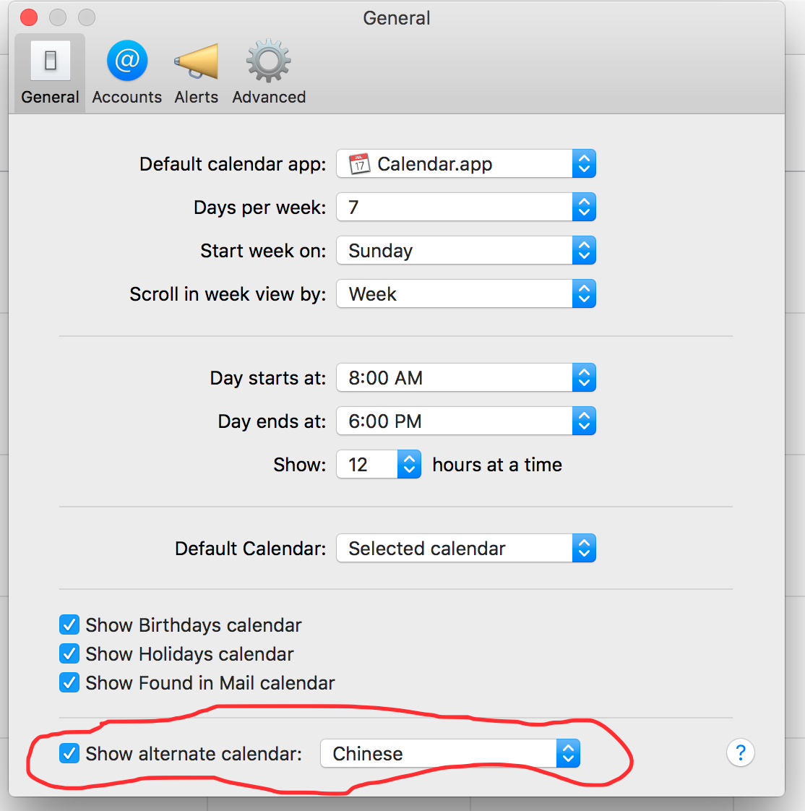

### 折腾mac

折腾mac todo

1. 一套著名的配色方案, [http://ethanschoonover.com/solarized]
2. iterm2的介绍todo: https://laoshuterry.gitbooks.io/mac_os_setup_guide/content/4_ZshConfig.html
3. 这个讨论特别好, 关注fish todo: [https://www.v2ex.com/t/91336]
4. fish的简介 todo: https://fishshell.com/docs/current/tutorial.html

### 农历/阴历设置

在calendar的设置里面设置一下就可以了. 

 

参考: https://msol.io/blog/tech/work-more-efficiently-on-your-mac-for-developers/

