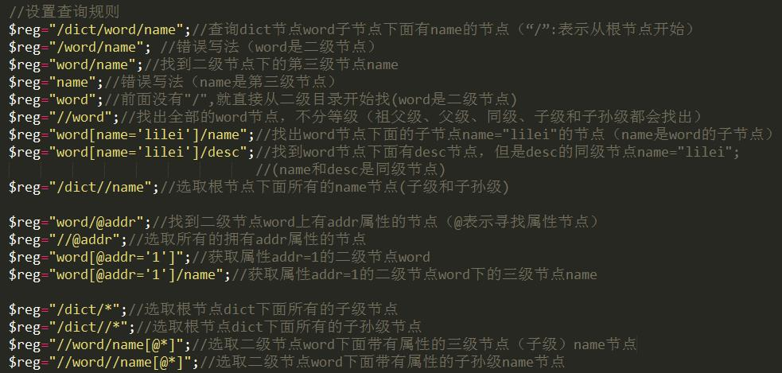

> 缘起: 用正则吭哧吭哧的扒了页面信息. 但是, 听到大婶说, 用xpath. 麻药, 难道我走错路了.

1. http://ued.ctrip.com/blog/how-browsers-work-rendering-engine-html-parsing-series-ii.html


### html5

html5能用吗?

- There are 2 XMLs: Lexical XML and Parsed XML. XPath works against a Parsed XML representation, such as DOM or XDM. You can therefore create Parsed XML from Lexical HTML5, that way you can query HTML5 using XPath.
- 亲身测试, xpath不碍h5啥事, 解析h5和之前的html没啥区别.
- 记得要加@抑制报错.


### php库有多少个呢? 

- DOM
- XMLReader/Writer
- XML Parser
  - http://www.w3school.com.cn/php/php_xml_parser_expat.asp
  - 基于事件
- SimpleXML
- ...
- 4个方法: http://www.voidcn.com/blog/smcfy/article/p-4420554.html
- 1. XML Expat Parser：
  2. SimpleXML
  3. XMLReader
  4. DOMDocument

### xpath举例

```php
//这两句效果是一样的.
$address=$xm->xpath('//div[@class="wrapper" and @data-cs-p="景点位置"]/div[@class="r-title"]/h2/..');
$address=$xm->xpath('//div[@class="wrapper" and @data-cs-p="景点位置"]/div[@class="r-title"][h2]');
```


## SimpleXml

- 参考: http://www.ibm.com/developerworks/cn/xml/x-datamineparsephp/
- https://www.ibm.com/developerworks/cn/xml/x-xpathphp/

```php
#得到SimpleXMLElement
$xml = simplexml_load_file('listing4.xml');#直接解析
simplexml_load_string(); #也可以这样, 如果已经有了string了的话.
/** 因为html不是xml所以要下面的写法*/
$dom = new DOMDocument();
$dom->loadHTMLFile('http://example.com/');
$xml = simplexml_import_dom($dom);
# 现在
$h4 = $xml->xpath('/html/body/div/div/div/h4');#拿h4
$links = $xml->xpath('//a[@href]');#拿链接
foreach ($links as $l) {
    echo $l['href'], "<br />\n";
  #此处如果要处理链接, 可以使用parse_url
}
?>
```

```php
#操作SimpleXMLElement, 例如
object(SimpleXMLElement)#610 (2) {
  ["@attributes"]=>
  array(3) {
    ["href"]=>
    string(15) "/poi/12415.html"
    ["target"]=>
    string(6) "_blank"
    ["data-tags"]=>
    string(0) ""
  }
  ["strong"]=>
  string(12) "奈良公园"
}
#用对象方法可以拿到子元素.
$u->'strong';//这里拿到的依旧是一个simplexml. 
#用数组方法可以拿到属性
$u['href']; //这里拿到的依旧是个数组. 只有一个元素的数组.

```

```php
再举一个比较艰难的例子:
var_dump($xxx);  //下面是输出:
array(1) {
  [0]=>
  object(SimpleXMLElement)#919 (3) {
    ["@attributes"]=>
    array(1) {
      ["class"]=>
      string(5) "intro"
    }
    ["dt"]=>
    object(SimpleXMLElement)#613 (1) {
      ["p"]=>
      object(SimpleXMLElement)#925 (2) {
        ["@attributes"]=>
        array(3) {
          ["data-simrows"]=>
          string(1) "2"
          ["data-format"]=>
          string(1) "1"
          ["style"]=>
          string(34) "overflow: hidden;max-height: 48px;"
        }
        ["span"]=>
        string(544) "奈良公园是位于奈良市若草山麓的都市公园，、等奈良的名胜古迹都在这里，是游奈良的必到之处。
位于公园附近的是俯瞰奈良风光的绝妙之地，每年1月还会在这里举行“若草烧山”等传统活动。
悠闲自在地漫步其中是游览公园的最佳方式，这里还有最集中的鹿群，喂食萌萌的小鹿也是游人最大的观赏点。
这里的鹿也极富灵性，见到游人手上有鹿饼会主动走来，所以需要当心成群结队的小鹿来将你扑倒哦。"
      }
    }
    ["dd"]=>
    array(6) {
      [0]=>
      object(SimpleXMLElement)#22 (2) {
        ["span"]=>
        string(6) "电话"
        ["p"]=>
        string(14) "(81-742)220375"
      }
      [1]=>
      object(SimpleXMLElement)#920 (2) {
//后面的输出省略了. 我们如何拿到: string(544) "奈良公园是
print_r($result[0]->dt->p->span); //这样不行, 会拿到莫名的东西. 关键是字符串不见了.
print_r((string)$result[0]->dt->p->span);//这样就ok了.

# print_r 各种不正常, 
print_r((string)$result[0]->dt->p->span);
print_r($result[0]->dd[0]->p[0]);
print_r($result[0]->dd[1]->p->a);
print_r($result[0]->dd[2]->span);

#echo 都是正常的.
echo "\n dt span: ", $result[0]->dt->p->span;
echo "\n dd p: ", $result[0]->dd[0]->p;
echo "\n dd p a: ", $result[0]->dd[1]->p->a;
echo "\n dd span: ", $result[0]->dd[2]->span;

#拿到字符串.
strip_tags((string)$result[0]->dd[$i]->p->asXML());
#处理成json, 再处理为数组
$res = json_decode(json_encode($result), true);

```

参考: http://www.phper163.com/archives/335

http://www.cnblogs.com/kenshinobiy/p/4358641.html

http://www.phperz.com/article/14/1124/4438.html

http://www.jb51.net/article/51127.htm


### xpath

- xpath能直接拿到某个标签的内容.
- 爬虫官方帮助: https://doc.phpspider.org/developer_tools.html
- 就应该参考这一篇: http://www.w3school.com.cn/php/func_simplexml_xpath.asp

```xml
<?xml version="1.0" encoding="ISO-8859-1"?>
<note>
<to>George</to>
<from>John</from>
<heading>Reminder</heading>
<body>Don't forget the <thing>meeting!</thing></body>
</note>
```

```php
<?php
#simple写法
$xml = simplexml_load_file("test.xml");
$result = $xml->xpath("from");
print_r($result);
#传统写法: http://php.net/manual/zh/book.dom.php
$doc = new DOMDocument;
// We don't want to bother with white spaces
$doc->preserveWhiteSpace = false;
$doc->Load('book.xml');
$tbody = $doc->getElementsByTagName('tbody')->item(0); //针对dom的操作.
$xpath = new DOMXPath($doc); //这个doc可以替换成tbody
// We starts from the root element
$query = '//book/chapter/para/informaltable/tgroup/tbody/row/entry[. = "en"]';
$entries = $xpath->query($query);
echo $entries;
?>
```

### 新的写法

http://php.net/manual/zh/simplexmlelement.xpath.php

```php
<?php
$string = <<<XML
<a><b>  <c>text</c><c>stuff</c>  </b></a>
XML;
$xml = new SimpleXMLElement($string);
/* Search for <a><b><c> */
$result = $xml->xpath('/a/b/c');
while(list( , $node) = each($result)) {
    echo '/a/b/c: ',$node,"\n";}
/* Relative paths also work... */
$result = $xml->xpath('b/c');
while(list( , $node) = each($result)) {
    echo 'b/c: ',$node,"\n";}
?>
```

### 传统写法

- http://php.net/manual/zh/book.dom.php

- http://php.net/manual/zh/class.domxpath.php 

```php
// create document object model
$dom = new DOMDocument();
// load html into document object model
@$dom->loadHTML($html);
// create domxpath instance
$xPath = new DOMXPath($dom);
// get all elements with a particular id and then loop through and print the href attribute
$elements = $xPath->query('//*[@id="lg"]/img/@src');
```

更简单的传统写法, http://php2012web.blog.51cto.com/5585213/1619260

```php
$dom=new DOMDocument();//创建dom对象. 这一句可以指定编码. 比如new DOMDocument('1.0', 'gbk');
$dom=loadHTMLFile($url);//加载对应html内容.这句代码前面最好加上 @ 符号，因为在加载解析HTML内容时，或多或少会出现错误，如：在HTML页面内一些 & 符号要转义成 &amp; ，html实体符号必须以 ;结束等等 才能顺利解析。而这类要求在采集过程中是不可能的
$xpath=new DOMXPath($dom);//创建xpath对象.
```

### query，和evaluate

DOMXPath有两个函数用来操作内部节点：

- query：取出给定的XPath表达式节点列表，只要表达式合法，返回DOMNodeList对象,否则返回false。
- evaluate：取出给定XPath表达式节点列表，只要表达式合法并且有匹配的节点返回DOMNodeList对象，否则返回false。

#### DOMNodeList对象

DOMNodeList 对象有一个函数和一个属性：

```php
/* 属性，节点列表个数 */
readonly publicint $length ;
/* 方法获取第几个节点 */
DOMNode DOMNodelist::item ( int $index )
#使用item函数获取的节点 DOMElement 对象
```

#### DOMElement 对象 

- 可以使用 getAttribute 获取节点属性值，
- 也可以使用 nodeValue 属性获取节点内容。


### 参考

http://www.w3cschool.cn/xpath/xpath-syntax.html

##### 常用表达式实例：  

```php
如果使用class属性来定位元素，最好使用contains函数，因为元素可能含有多个class
"selector" => "//div[contains(@class,'page-header')]//h1/a"
如果使用id属性来定位元素，因为理论上id是唯一的，可以直接使用*[@id='']
"selector" => "//*[@id='single-next-link']"
```

## php里面xpath.写法

```php
$xpath='//*[@class="clearfix"]/li/a[@href]';
$re=$xml->xpath($xpath);
1. xpath写成:相对的路径是不行的. 
'a/b', 这样是不行的, 必须/或者//开头.
$xpath='li/a[@href]'; //这样就搜索不出任何结果.补充一句这样写在xml里面没有问题.
$xpath='//li/a[@href]';//这样就ok了.
2. xpath的属性写成不带@的形式是不行的. $xpath='//div[id="container"]'; //这样是不行的. 没有@.
$xpath='//div[@id="container"]'; //这样OK了.
$xpath='//*[@class="clearfix"]'; //这样对于class, ok了.
$xpath='//ul[@class="clearfix"]';//这样也ok了.
3. 中间元素是array咋办, 比如li是array.
$xpath='//ul[@class="clearfix/li/a[@href]"]';//这样不行, 不是因为li是个array, 是因为这里的引号和括号都乱了.
$xpath='//ul[@class="clearfix//a[@href]"]'; //这样略过li也不行. 不应该不行, 佛祖啊, 是因为引号和括号乱套了.
$xpath='//a[@href]'; //这个可行但是拿到的东西太多了.
$xpath='//ul[@class="clearfix"]/li/a[@href]';//这样是可以的, 狗屎, 前面一堆括号和引号错误.
$xpath='//ul[@class="clearfix"]/li/a[@href]/strong/..';
//取 <ul class="clearfix"><li><a href=""><strong> 这样的结构里面的<a>元素.
```

参考: http://www.w3cschool.cn/xpath/xpath-syntax.html
https://doc.phpspider.org/developer_tools.html

### 结论

1. 反复测试了, xml里面a/b这样的路径是ok的, 但是html里面a/b这样的路径就是不ok, 一定要指明不是根//a/b这样就ok了.
2. [@id='xxx']和[id='xxx']真心不是一个含义, 前面@属性id的值xxx, 后面是子元素id的值是xxx了.
3. 如果不写='xxx', 那么就是要求有这个属性, 对值没有要求.


### xpath选取兄弟元素

1. 试验一下遍历对象 ok了
2. 第一个对象是否是h3，如果是，就取下一个对象
3. 但是, 还可以尝试下xpath的选取. div或者table


```php
$xp="tr/td[@class='name']/following-sibling::td"
//To get it immediately:
$els = $xpath->query("//div[@name='node']/following-sibling::*[1]");
//To get it when you already have a <div name="node">:
$nextelement = $xpath->query("following-sibling::*[1]", $currentdiv);
```

参考:http://stackoverflow.com/questions/3139402/how-to-select-following-sibling-xml-tag-using-xpath
http://stackoverflow.com/questions/9549300/select-the-next-node-of-the-selected-node-in-php-dom

### simplexml

参考: http://www.dimuthu.org/blog/2008/09/30/xpath-in-simplexml/
http://www.hackingwithphp.com/12/3/3/searching-and-filtering-with-xpath

```xml
<dwml>
  <data>
    <location>
      <location-key>point1</location-key>
      	<point latitude="37.39" longitude="-122.07"></point>
      </location>
  </data>
  .....
</dwml>
```

```xpath
xpath:
/dwml/data/location/point/@latitude   结果是37.39
```

```php
$simplexml= new SimpleXMLElement($xml);
//直接选取
$simplexml->data->location->point->attributes()->latitude
//用xpath选取
$lats =  $simplexml->xpath('/dwml/data/location/point/@latitude');
$lats =  $simplexml->xpath('//@latitude');//更简洁的xpath
//特别提示, 下面这种写法是对的, 但是, 注意到了吗? 不要从html选择起, html是根目录, 简单地说$xml就是那个html标签.
$xml->body->div->a->attributes()->class;
$xml->body->div->a['class']; //这样也行的.
$xml->xpath('//@class');//这种形式也是一样的.
//xpath可以使用各种xpath函数, 比如last(), position(), 甚至于substring
//还可以使用通配符axes, 比如*
$xml->xpath('//mynode[last()]');//这个意思是选择最后一个mynode. 
'ancestor::*' //这个xpath意思是当前元素的所有祖先.
$xml->xpath('/employees/employee[age<54]');
$xml->xpath('//employee[age>=48]/age');
$xml->xpath('//employee[age>=49][name="Laura Pollard"]');//年龄49, 且名字劳拉
$xml->xpath('//employee/title|//employee/age'); //这里是一个或者关系
$xml->xpath('//employee[age<40]/name|//employee[age>50]/name');
$names = $xml->xpath('//employee[age mod 2 = 1]/name');//这里取得是奇数年龄, 妹呀, xpath真支持不少东西.
```

