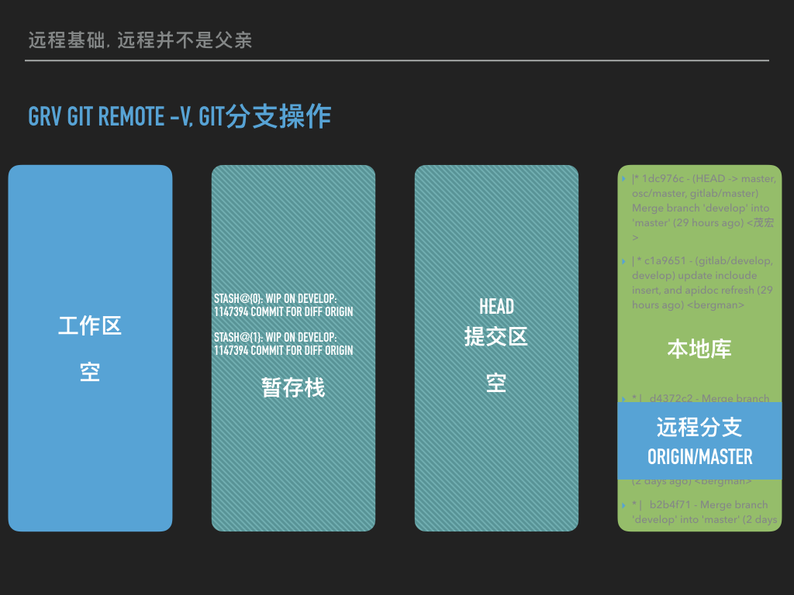
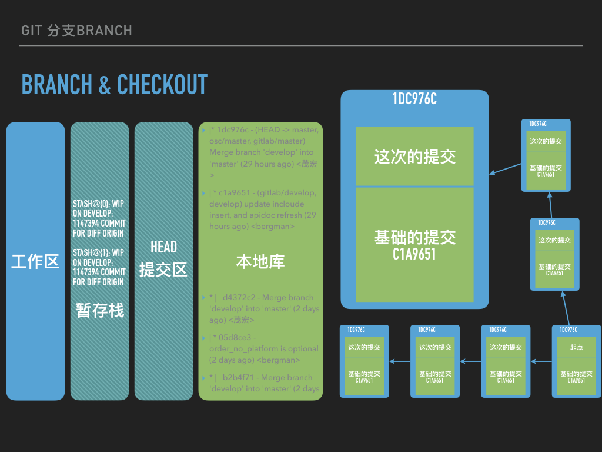

> 这个文档写给最初级的初级选手, 网上的介绍大多千篇一律, 并且多是从git pro的思路来介绍的, 那个思路其实很绕, 不是我们正常是用git的思路.

### 文档分三个部分

1. git是分层次的
2. git和周边工具的关系
3. git原理

### git是分层次的.

1. 没有git的时候
2. 没有控制的时候
3. 没有提交的时候
4. 没有和远程发生关系的时候

### 没有git的时候

> 这个时候其实你有两个做法
>
> 1. 本地建个库 git init
> 2. 远程clone一个库

clone使用在这里, init也在, 其他所有的git命令和这两个不再同一个层次, 这两的命令的意思都是:

-  在这个地方, 给我建个仓库,
-  建个仓库,
-  建个仓库. 重要的事说三遍.


1.  git init 是说建个空仓库, 这个命令其实很复杂, 不建议初级选手尝试.

   ```sh
   这行字很有用, 但是如果看不懂可以忽略, 等看得懂的时候再看,
   注意, 这个仓库只能本地 commit, 别人如果远程, 是只能 pull(更正确的做法是fetch rebase), 不能 push 的, 如果要建一个别人能 push 的仓库, 需要建裸体库, 但是, 其实建裸体库本身不是太好的操作, 这也是linus说github没有理解git的一个点.
   ```

2.  git clone 意思是以别人的库为范本, 本地克隆一个库. 初级选手一般接触的都是这个. 


> 再次强调, 只有init和clone两个命令是同一个层次的, 就是在这地搭个仓库, 其他命令都不在这个层次.

这里还有一个关键点, 已经是仓库的地方, 就不要再做任何init或者clone操作了. 没有好结果. 如何判断呢? 用git status看看. 不是仓库的地方, 会直白的反馈你, 这里没有git 仓库.

### 没有控制的时候

> 这个地方有两个实际的操作, 添加和忽略, 还有一个辅助操作, 查看添加内容.

```sh
gaa # 添加是add, 新人容易错在add的参数, 推荐使用gaa, 没错, 他就是你想的那样, 把所有改动都add进版本控制.
gitignore #忽略一般我们都写配置文件, 这个单独说, 之前的文章里面有. 话说, 如果一个文件不需要受到版本控制, 咱们干嘛把他放到git目录? 参见隔壁: gitignore
git show
gd  # 这两个都能看出变化
git stash #暂存修改. 可以切个分支再提交...
```

参见隔壁: 2017-09-07 git提交


### 没有提交的时候

> 这个时候要提交, 同样提交之前要看状态, 参见上面说的: git提交

```sh
gcam
glgp
git stash
```

参见隔壁: 2017-09-06 git跟踪某个文件

### 没有和远程发生关系的时候

```sh
### pull和push发生在这里. 一共有三套操作
git fetch
git rebase #这两个命令组合是一套
git pull # 这个不建议用, 但是, 他是一个命令, 比上面的两个命令有优势, 所以, 你可以配置下. 参见隔壁: git十全大补

```


### git和周边的关系

> 讲完了git的层次, 我们可以看看这些git命令的本质了.

- git diff 并不是git里面的diff, 而是用diff处理git目录里的文件. diff也是一套工具.
- git log也不是git里面的log, 而是用log工具处理git记录.
- 同样的道理我们都可以类推.

### git的原理

> 用原理串一下, 你就理解了.




我们要认清git有4个区:

1. 你的工作正常实在工作区.
2. 你可以用stash把工作挪到暂存区.
3. 也可以用add, 加到提交区.
4. commit把内容从提交区正式放入本地库, 形成md5的版本号, 打tag野打在这里, 啥log啊, 提交记录啊, 都关联在这个md5上面.
   1. 远程还有远程库. 这个可以没有.
   2. 远程库和本地库没有区别.



每次说git, 我们都可以说说这个块链结构, 这是他的精髓.

1. 每次的修改都分两部分, 
   1. 本次修改.
   2. 一个连接指向这次修改的底本.
2. 因此, 都有同样的根的两次提交, 可以自动合并.
3. 每次提交都包括了哪些内容, 版本库一清二楚.


远程并不等于块链的上级, 也可能本地的才是上级. 远程分支和本地分支是一样的东西, 不需要区别对待.


