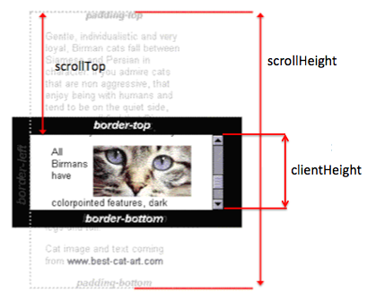

###### 图示



- from: https://stackoverflow.com/questions/270612/scroll-to-bottom-of-div

###### 数据指标

```js
//全文档高度  element.scrollHeight //这个是基础, 只读
document.body.scrollHeight 
document.documentElement.scrollHeight

//滚动位置
window.scrollY  //可以设置, 但是没用, 当做只读吧
document.scrollingElement.scrollTop //可读可写. 

//一屏高度
window.innerHeight //这个是窗口的高度. 含滚动条本身占用的空间.
document.body.clientHeight,
document.documentElement.clientHeight  //窗口高度, 去除了滚动条本身占用的净高度.

//关于offsetHeight 要特别说明 尽量别用这个, 含义并不确定
document.documentElement.offsetHeight //屏幕高度
document.body.offsetHeight //是文档高度(也可能是屏幕高度, 如果用了懒加载技术)


//不可用
document.body.scrollTop //永远是0 不可设置 已经是废弃状态, 正常应该是指body的滚动情况, body本身不可能滚, 所以都是0. 


//拆分的元素
document.body 是 <body>;
Document.documentElement 是 <html>;
document.scrollingElement 正常返回documentElement, 不正常返回body或者null
clientHeight  包含padding的高度
offsetHeight  包含border和滚动条本身的高度
scrollHeight  包含不可见内容的高度
innerHeight   windhow才有这个属性, 代表的是浏览器内容窗口的尺寸, 含滚动条
```


###### 动作

```js
//绝对滚动函数 = scrollto 
window.scroll(0,document.body.scrollHeight);//参数方式, 滚到底.
window.scroll(0,document.querySelector(".scrollingContainer").scrollHeight);

window.scroll({  //option方式
  top: document.body.scrollHeight,
  left: 100,
  behavior: 'smooth'
});

//相对滚动函数
window.scrollBy({   //option方式
  top: document.body.scrollHeight,
  left: 100,   
  behavior: "smooth" 
});

//第三个函数
element.scrollIntoView(false); //true代表top
document.body.scrollIntoView(false);

document.body.scrollIntoView(true);

//用参数设置方式滚到底
document.scrollingElement.scrollTop = document.scrollingElement.scrollHeight;
//一个元素内部滚到底
div.scrollTop = div.scrollHeight - div.clientHeight;
```

滚一屏

```
window.scroll(0,window.innerHeight);
window.scrollBy({   //option方式
  top: window.innerHeight,
  left: 0,   
  behavior: "smooth" 
});
document.scrollingElement.scrollTop = window.innerHeight;
```

回顶部

```
window.scroll({  
  top: 0,
  left: 100,
  behavior: 'smooth'
});
```

判断滚到底部了

```js
//这个答案过时了, document.body.offsetHeight并不一定是文档高度.
window.onscroll = function(ev) {
  if ((window.innerHeight + window.scrollY) >= document.body.offsetHeight) {
    //针对浏览器兼容
    (window.innerHeight + window.pageYOffset) >= document.body.offsetHeight
    //针对mac系统兼容
    (window.innerHeight + Math.ceil(window.pageYOffset + 1)) >= document.body.offsetHeight
    //针对zoom缩放
    Math.ceil(window.innerHeight + window.pageYOffset) >= document.body.offsetHeight
		
    //针对mac和zoom的简洁写法
     (window.innerHeight + window.pageYOffset + 2) >= document.body.offsetHeight
    // you're at the bottom of the page
  }
};
```

持续滚动到底

```js

!async function scroll2bottom() {
	while((window.innerHeight+window.pageYOffset+2)<document.scrollingElement.scrollHeight) {
	   await scroll1time();
	}
  async function scroll1time(){
    	scroll1screen();
	await	sleep(200);
		console.log('document.scrollingElement.scrollHeight:',document.scrollingElement.scrollHeight,'  window.innerHeight:',window.innerHeight,'  window.pageYOffset:',window.pageYOffset,'  document.body.offsetHeight:',document.body.offsetHeight,'  window.scrollY:',window.scrollY,'  document.scrollingElement.scrollTop:',document.scrollingElement.scrollTop);
  }
  
  
	function scroll1screen() {		//滚一屏
		window.scrollBy({   //option方式
			top: window.innerHeight,
			left: 0,
			behavior: "smooth"
		});
	}
	function sleep(ms) {//延迟执行的新写法
		return new Promise(resolve => setTimeout(resolve,ms));
	}
}();


```

