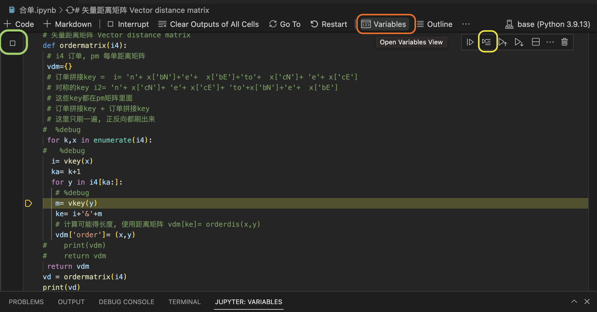

> 参考:  https://stackoverflow.com/questions/32409629/what-is-the-right-way-to-debug-in-ipython-notebook

### %debug

> 参考: https://ipython.org/ipython-doc/3/interactive/magics.html#magic-pdb

- 两种模式
  1. 在需要调试的代码前面加入这个, 开始调试
  2. post-mortem验尸模式, 出事之后立刻弄个单元格执行这个
- 操作
  - Type **“n”** and hit Enter to run the **next** **line** of code (The → arrow shows you the current position). 
  - Use **“c”** to **continue** until the next breakpoint. 
  - **“q”** **quits** the debugger and code execution.
- 发生的问题: 莫名就跟到了包里面

```python
# 有一个建议用两个百分号: 
%%debug
# 还有一个建议使用$pdb
%pdb on’, ‘%pdb 1’, ‘%pdb off’ or ‘%pdb 0’.
```


### 另外的建议

```python
breakpoint() # 这个是python3.7的断点设置
assert False, "breakpoint" # 另一种设置断点的方式

# 使用python的debugger
from IPython.core.debugger import Pdb; 
Pdb().set_trace()

from IPython.core.debugger import set_trace
set_trace()

# 使用ipdb, 需要先安装
import ipdb; 
ipdb.set_trace() 

# 使用pdb
import pdb; 
pdb.set_trace()

```

- 另一个建议; 
  - 安装`xeus-python`. 
  - 使用这个新的内核
  - 然后可以在notebook里面设置断点

> 最后结论: 抛弃网页版本的notebook, 改为使用vscode

### vscode bebug notebook

- 安装插件: 
  - python
  - jupyter
- 按照提示安装
  - conda install ipykernel
- 注意弄好上述内容之后, 需要重启vscode, 不然各种不正常

### 图示



###### 单行执行: 

- 上图黄框

###### 查看变量

- 上图桔框

###### 断点调试

- 上图绿框

###### 死机咋办

- 工具栏: restart

###### 执行当前cell

- Ctrl+Enter runs the currently selected cell, 
- Shift+Enter runs the currently selected cell and inserts a new cell immediately below (focus moves to new cell), 
- Alt+Enter runs the currently selected cell and inserts a new cell immediately below (focus remains on current cell). 
- These keyboard shortcuts can be used in both command and edit modes.

###### 执行多个cell

- run all
- run 上箭头, 执行所有之前的
- run 下箭头, 执行当前和所有之后的

###### move cell

- 左边条部分可以拖动
- esc模式, alt+箭头可以移动cell

###### markdown和python

- 右下角可以切换
- 下边框可以决定新加的cell是md还是py

###### 显示行号

- esc模式下L
- 全局开行号: shift+L

###### 打开outline

- setting: **Notebook > Outline: Show Code Cells**.

> 参考官网: https://code.visualstudio.com/docs/datascience/jupyter-notebooks
