> pyside的事件机制

我在macos15.7中使用pyside6编写app, 在gv(view/scene)架构中要处理快捷键. 我的edititem在输入状态时, 貌似不响应shortcut和action, 是这样的吗? 我有2组快捷键, 分别处理两个情况:
1. 处理所有的edititem都不在编辑状态的快捷输入, 比如
   * 移动光标(item的选中状态),
   * 移动/交换某个item
2. 某个textitem在编辑状态, 输入时, 响应快捷键, 比如
   * 结束编辑, 
   * 移动光标.
   那么我要怎么分布这些快捷键? 我本来考虑都用无父的action来处理, 但是这样似乎对于tab, enter,这种单独的按键不太行, 对于编辑状态的textitem也貌似有点问题. 是我哪里搞错了, 还是什么原因?


不要再给代码了, 咱们说原理. 
1. 编辑状态的事件必须在QGraphicsTextItem内部处理, 其中子类化重载keyPressEvent是比较简洁低耦合的处理方式, 包括编辑态时回车和tab的响应. 那么如何判断自身处在编辑态呢? hasfocus只是获得焦点, 不代表自身在编辑态吧?
2. 非编辑态用action处理, 此时能处理enter/tab吗?

我感觉对于pyside6的事件处理还是比较懵的, 你能给我新建一个测试文件, 让我看明白, widget 和 graphicitem的所有事件处理机制吗? 尤其是action/shortcut, 我期望能干净的处理全局快捷键和编辑状态的快捷键. 现在看来. 用action+item自己的presskey是不是最干净简洁低耦合的方案? 最清爽不容易冲突的方案? 用个例子说明下.

我看了我原始的代码,  我原本在graphicview的keypressevent里面处理了编辑态的item的快捷键. 为啥他能处理?
另外, 我感觉对于pyside6的事件处理还是比较懵的,  尤其是action/shortcut, 我期望能干净的处理全局快捷键和编辑状态的快捷键. 现在看来. 用action+item自己的presskey是不是最干净简洁低耦合的方案? 最清爽不容易冲突的方案? 


编辑态和非编辑态的事件传播是怎样的? action/shortcut/filter的机制是怎样发挥作用的? 帮忙讲讲原理, 让我建立基本的mindmap


我看你的描述, 先说了shortcut是最后的处理机会, 优先是EventFilter > keyPressEvent > Shortcut, 但是流程图的步骤中又是:
1. shortcut处理
2. eventfilter处理, 此时可以拦截.
3. 目标的责任链(keypressevent), 此时也可以拦截.
那么他们的顺序究竟是怎样的? 这里貌似矛盾了, 讲清楚他们的顺序, 以及每一个手段的拦截关系. 是必然被拦截, 还是可以拦截, 还是不可以拦截. 


你说的好乱啊, 我问的是graphicview里面的graphictextitem, 你说了一堆的widget. 然后, 下面这些说法对吗?
QAction / QShortcut 机制, 实际是在父widget上安装filter
你讲的是widget, 我问的是graphicitem, 这个一样吗? 内部编辑器是一个QWidget，有自己的焦点和事件处理！也就是说graphicitem中有个widget?


另外, 方向键(上下左右), 回车键, tab键, 在shortcut/action中处理貌似是可以的. 但是, 如果在keypressevent中就不一定了. 为什么? shortcut/action/filter的优先级很高吗? 这些事件响应的手段之间的阻挡关系式怎样的? 另外, 我的app里面是多个window, 然后里面分栏, 每个栏里面有widget作为tabbar, 然后每个栏都是个graphicview里面还有能进入编辑状态的textitem. 所以我这个架构本身就有点复杂, 所以这是我需要一个牢靠的事件架构的原因.


### 建议
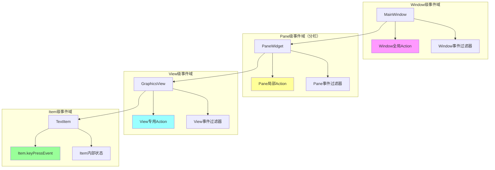

| 层级       | 职责                         | 手段                                     | 快捷键示例       |
| ---------- | ---------------------------- | ---------------------------------------- | ---------------- |
| **Window** | 应用级命令（保存、退出）     | `QAction` + `ApplicationShortcut` 上下文 | Ctrl+S, Ctrl+Q   |
| **Pane**   | 面板级命令（切换标签、分割） | `QAction` + `WindowShortcut` 上下文      | Ctrl+Tab, Ctrl+T |
| **View**   | 视图级命令（缩放、平移）     | `QAction` + `WidgetShortcut` 上下文      | +/-, Space       |
| **Item**   | 编辑态命令（结束编辑、缩进） | 重载 `keyPressEvent`                     | Enter, Tab, Esc  |

### 原理澄清

[非编辑态]
用户按键 → Shortcut系统 → QAction → Command对象 → Scene/View
                               ↑
                        纯数据，无状态

[编辑态]
用户按键 → Item.keyPressEvent → Item内部状态管理 → 编辑命令
                               ↑
                        自包含，不依赖外部


###### 事件图
OS 键盘事件
    ↓
QGraphicsView（第一层：可选预处理）
    ↓
QGraphicsScene（第二层：可选预处理）
    ↓
QGraphicsItem（第三层：焦点项）
    ↓
  【分岔】
  ├─ 有 TextEditorInteraction 标志？
  │   └─ YES → QTextControl（内部编辑器，消耗事件）
  │       └─ 事件结束
  │   └─ NO  → item.keyPressEvent() → item.ignore()
  │       ↓
  │   事件继续冒泡
  │       ↓
  └─ NO焦点项 → Shortcut系统 → QAction → 全局命令


| 机制                 | 触发时机           | 作用域      | 能否拦截 Editor   |
| -------------------- | ------------------ | ----------- | ----------------- |
| **eventFilter**      | 事件到达对象前     | 任意对象    | ✅ 能拦截          |
| **keyPressEvent**    | 事件到达对象时     | 当前对象    | ❌ 不能拦截 Editor |
| **QAction/Shortcut** | 事件未被 accept 时 | 全局/Widget | ❌ 不能拦截 Editor |


┌─────────────────────────────────────────────────┐
│            Qt 事件处理三大层次                   │
├─────────────────────────────────────────────────┤
│  Level 1: 事件过滤器 (Event Filters)            │
│           ↑↓ 最先/最后拦截                       │
├─────────────────────────────────────────────────┤
│  Level 2: 事件处理函数 (Event Handlers)         │
│           ↑↓ 对象自身处理                        │
├─────────────────────────────────────────────────┤
│  Level 3: 动作系统 (Actions/Shortcuts)          │
│           ↑↓ 全局快捷键/菜单                     │
└─────────────────────────────────────────────────┘

非编辑态, 此时焦点在view上
关键点：非编辑态时，Action/Shortcut在View处理之前就有机会匹配！
键盘按下 → 操作系统 → QApplication
                    ↓
             QApplication.event() 
                    ↓
            [Level 1] QApplication的事件过滤器
                    ↓
            [Level 3] QShortcut/QAction 全局匹配 ←─┐
                    ↓                             │
            QGraphicsView.keyPressEvent()         │
                    ↓                             │
            [Level 1] View的事件过滤器            │
                    ↓                             │
            super().keyPressEvent()  → 传递给Scene → 传递给Item
                    │                             │
            └────→ 如果View不处理 ────────────────┘

编辑态
编辑态时，焦点在Item的"内部编辑器"，不是Item本身
内部编辑器是一个独立的QWidget，有自己的事件循环
Action/Shortcut默认无法"穿透"到这个内部编辑器
键盘按下 → 操作系统 → QApplication
                    ↓
             QApplication.event()
                    ↓
            [Level 1] App过滤器
                    ↓
            [Level 3] QShortcut 尝试匹配 ❌ ←─ 通常失败！
                    ↓
            QGraphicsView.keyPressEvent() ←─ 你可能在这里拦截了！
                    ↓
            super().keyPressEvent()  → QGraphicsScene
                    ↓
            QGraphicsScene.keyPressEvent()
                    ↓
            QGraphicsTextItem.keyPressEvent() ←─ 编辑态在这里
                    │                            内部有QTextDocument
                    ↓
            [文本编辑器内部处理] ←─ 事件被"吞噬"在这里

1. QAction / QShortcut 机制, 实际是在父widget上安装filter,
   * Action匹配时机：在QApplication.event()分发时检查，早于具体Widget的keyPressEvent！
2. filter机制, 安装顺序：后安装的先执行（栈式）, 返回值：
   * True：事件被过滤，不再传递
   * False：继续传递给下一个过滤器或对象本身

从早到晚的拦截机会：
1. QApplication的事件过滤器 (最早)
2. QShortcut/QAction 全局匹配
3. 目标Widget的事件过滤器
4. 目标Widget.keyPressEvent() ← 你通常在这里处理
5. 父Widget的事件传播
重要：一旦事件被accept()，传播链就终止！


一、事件流的本质：不是传播，是"责任链"
Qt 的事件处理基于 "处理即终止" 原则，不是自动传播，而是先到先得，处理即消化。

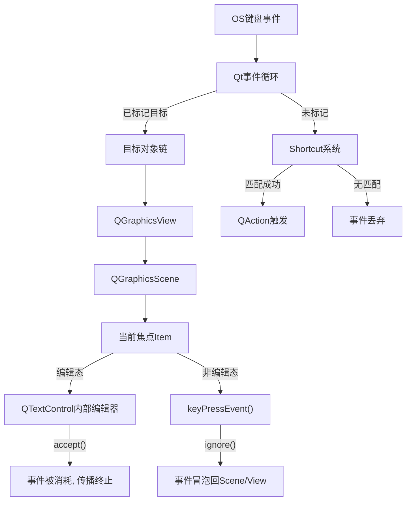

非编辑态

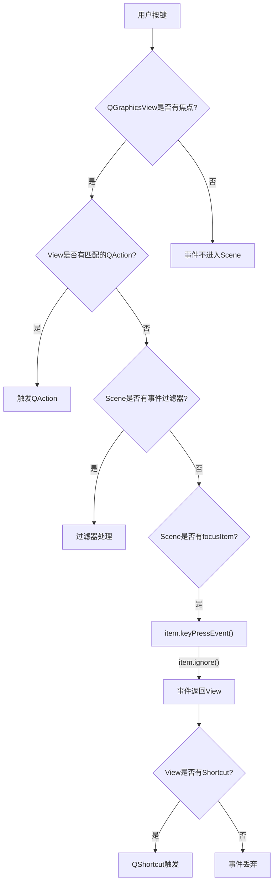

编辑态
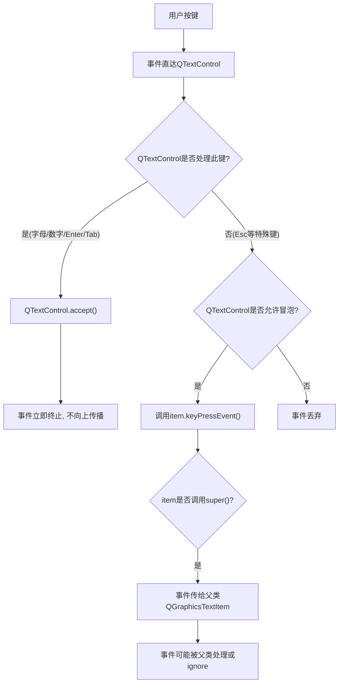


eventfilter
战场：事件到达目标前，最高优先级
权限：能拦截编辑态事件，但必须主动安装在 QTextControl 上（难度大，不推荐）
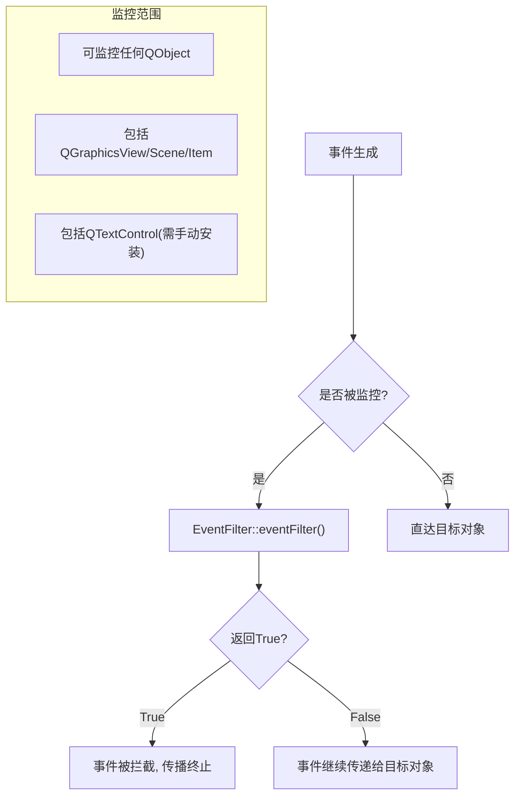

keypressevent 自治机制
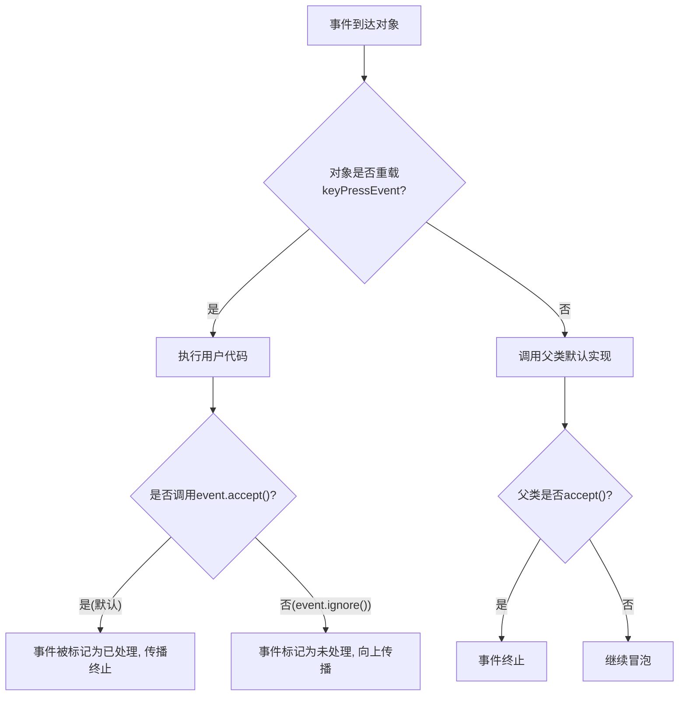


shortcut 全局路由机制
战场：事件循环中，独立于对象传递链，最低优先级（实际上是最后机会）
权限：无法看到编辑态事件，因为已被 QTextControl.accept()
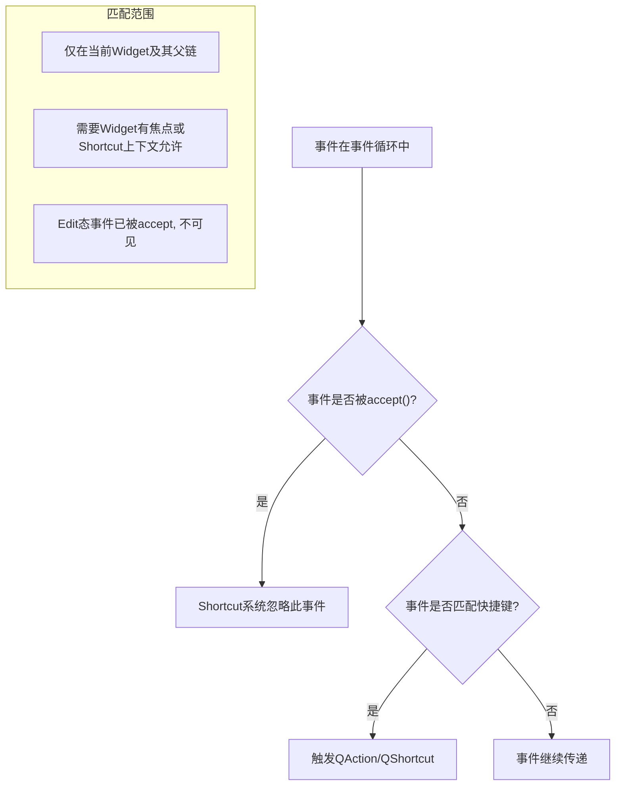


┌─────────────────────────────────────────────────────────────┐
│                    Qt键盘事件处理总览                        │
│              "事件不是传播，是责任链处理"                      │
└─────────────────────────────────────────────────────────────┘
                            │
                            ▼
         ┌──────────────────┴──────────────────┐
         │  事件生成（OS → Qt事件循环）          │
         └──────────────────┬──────────────────┘
                            │
         ┌──────────────────┴──────────────────┐
         │  第一步：Shortcut系统预检            │
         │  （事件是否已accept？否 → 匹配快捷键）│
         └──────────────────┬──────────────────┘
                            │
         ┌──────────────────┴──────────────────┐
         │  第二步：EventFilter链（若有）       │
         │  （返回True → 事件终止）             │
         └──────────────────┬──────────────────┘
                            │
         ┌──────────────────┴──────────────────┐
         │  第三步：目标对象责任链              │
         └──────────────────┬──────────────────┘
                            │
        ┌───────────────────┼───────────────────┐
        │                   │                   │
        ▼                   ▼                   ▼
┌──────────────┐   ┌──────────────┐   ┌──────────────┐
│  非编辑态    │   │   编辑态     │   │  无焦点项    │
├──────────────┤   ├──────────────┤   ├──────────────┤
│View→Scene→Item│   │直达QTextControl│   │回到Shortcut   │
│可ignore()冒泡 │   │强制accept()  │   │系统         │
│Shortcut可见   │   │Shortcut不可见│   │             │
└──────────────┘   └──────────────┘   └──────────────┘


编辑态 = 事件黑洞：一旦开启 TextEditorInteraction，事件进入独立宇宙，Shortcut 系统失明
非编辑态 = 事件民主：事件自由流动，Shortcut 系统可见，可冒泡
优先级: EventFilter > keyPressEvent > Shortcut


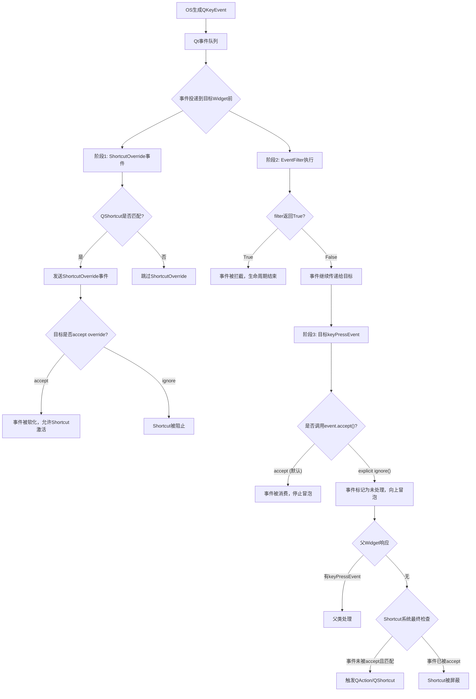
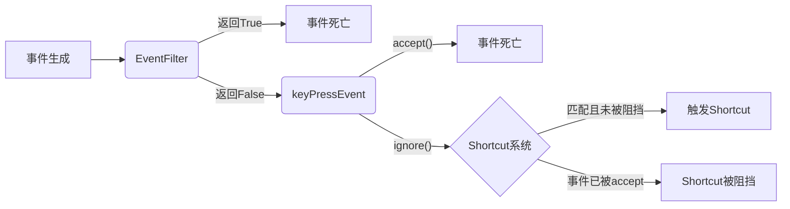


| 按键          | 在keyPressEvent中          | 在Shortcut中 | 原因                                      |
| ------------- | -------------------------- | ------------ | ----------------------------------------- |
| **方向键**    | **默认accept()**，不冒泡   | **可捕获**   | QWidget默认处理焦点移动，**主动accept()** |
| **Enter**     | **默认accept()**，不冒泡   | **可捕获**   | 默认激活按钮/默认操作，**主动accept()**   |
| **Tab**       | **默认accept()**，不冒泡   | **可捕获**   | 焦点切换键，**被事件系统特殊处理**        |
| **字母/数字** | **默认accept()**，输入字符 | **可捕获**   | 输入事件，**被当前焦点Widget accept()**   |


为什么 Shortcut 能"反杀"默认行为？
核心机制：ShortcutOverride 事件
Shortcut 系统先发制人，在事件投递前询问目标是否允许
如果目标不反对（ignore() the override），Shortcut 就劫持事件
默认情况下，Widget 对 ShortcutOverride 是 accept() 的（允许 Shortcut）
但 QTextControl 对 所有 override 都是 ignore() 的（垄断事件）
```py
# Qt内部简化逻辑
def deliverKeyEvent(event):
    # 阶段1：ShortcutOverride预检
    if matchesShortcut(event):  # 事件是否匹配注册快捷键?
        override_event = QShortcutOverrideEvent(event)
        sendEvent(focus_widget, override_event)
        
        if override_event.isAccepted():  # 目标Widget说"我允许Shortcut"
            # 阻止原本的keyPressEvent投递
            triggerShortcutAction()  # 触发QAction
            return  # 事件处理结束
    
    # 阶段2：正常keyPressEvent投递
    sendKeyPressEvent(event)  # 这会触发EventFilter→keyPressEvent链
```


非编辑态
键盘事件 → QGraphicsView → QGraphicsScene → QGraphicsItem
     ↑
QAction有机会匹配（因为焦点在View）


编辑态
键盘事件 → QGraphicsView → QGraphicsScene 
     ↑        ↓
QAction    QGraphicsProxyWidget（内部编辑器）
              ↓
          QLineEdit/QTextEdit ← 焦点在这里！
              ↓
          事件被处理，不传播


#### 最终问题:
所以编辑态下, graphicedititem是没有机会处理keypressevent的. 此时只用用eventfilter.
或者用graphicview的keypressevent. 那么, 这两个方案, 哪个更合理些呢?

在这个问题上, deepseek, kimi都开始胡说八道了.  我要用代码验证下.

1. 无父action/shortcut.
2. 全局filter
3. graphicview:
    * keypressevent
    * eventfilter
4. grahpicedititem的
    * keypressevent
    * eventfilter


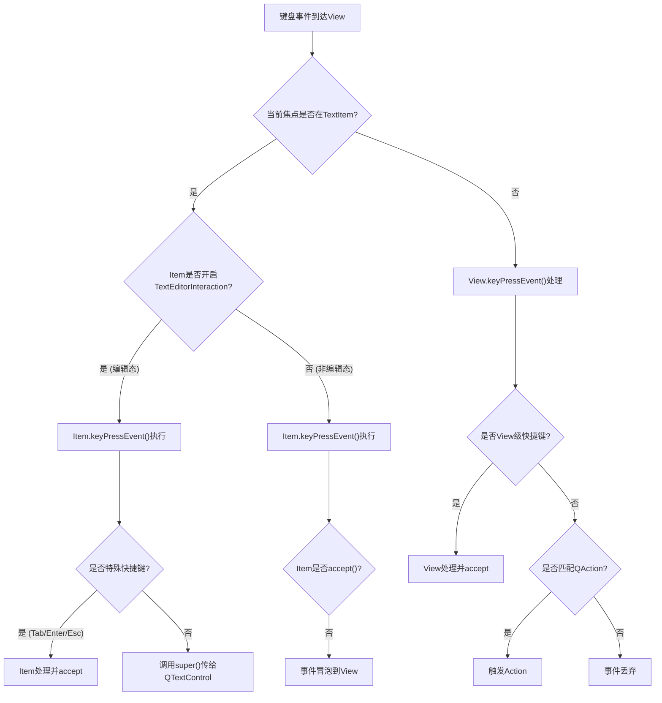


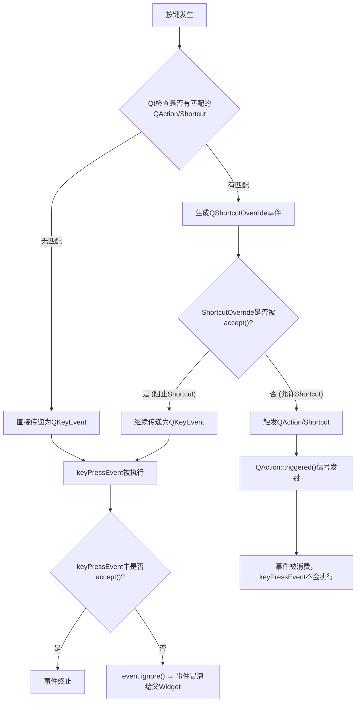

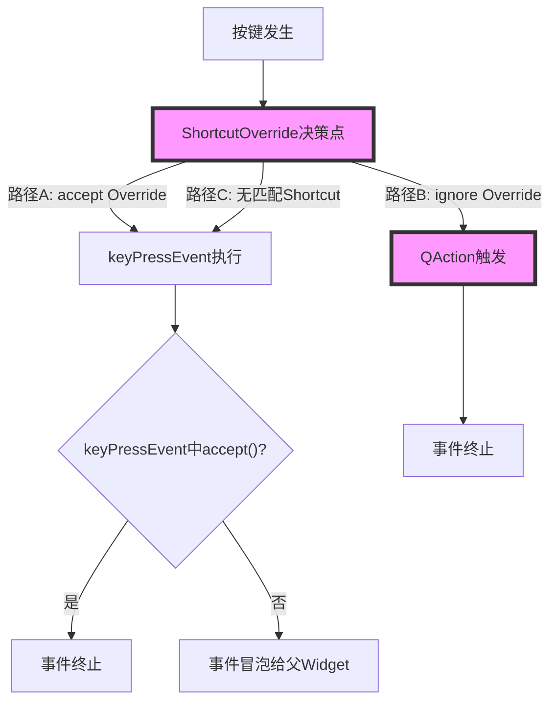

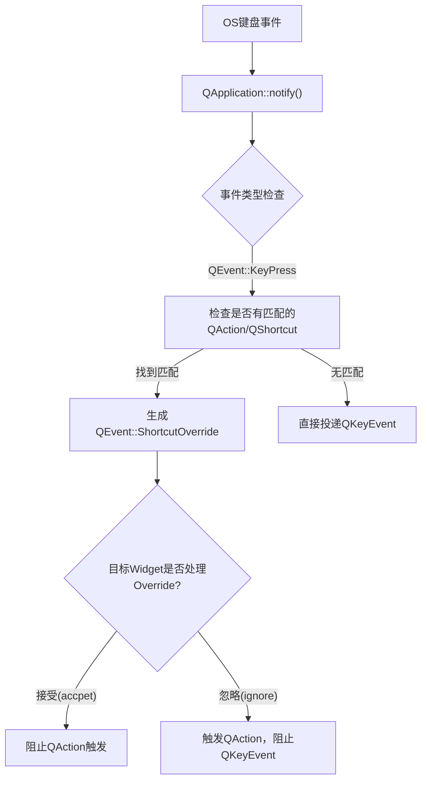


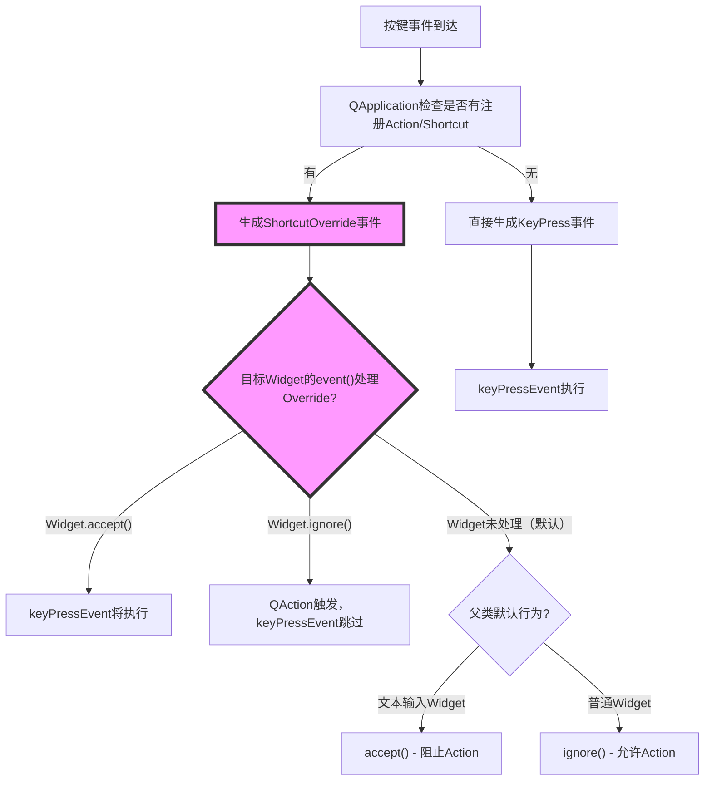


### 所以最终结论:
1. 用无父action/shortcut处理全局快捷键.
2. 用graphictextitem的keypressevent处理编辑态的快捷键.
3. 不论是方向键, tab, enter, esc, 删除键等等按键都可以这么处理:
   1. 在非编辑态, 无父action处理这些快捷键(他们分别有针对item的各种整体性操作)
   2. 在编辑态, 用graphictextitem的keypressevent处理这些快捷键, 这些操作只要针对正在编辑的文本内容.

可能你还是没理解, 咱们就搞一个enter键来说明.
1. 如果此时全局都没有item在编辑状态, 那么:
   无父action会找到当前焦点的view(他是个分栏)的当前选中状态的item, 然后给他新建一个弟弟item放在旁边.
2. 如果此时有一个item在编辑状态, 那么:
   这个item退出编辑状态, 但是保持选中状态.
   这其中focus状态由qt系统维护, 选中状态由我手动维护.
   这个方案是不是一个最合理的方案?


### 还有更终极的疑问
  new_act = QAction(txt, _global_menu)
  new_act.setShortcut(QKeySequence(keys))

  这里的keys是不是不支持单字符? 有文档吗? 我去看看, 和文档没关系, 支持单字符, 我之前就是成功了tab.


下面这两种写法是不同的吗? 太神奇了. 一个有响应, 一个没有
  new_act = QAction(txt, _global_menu)
  new_act.setShortcut(QKeySequence("Tab"))


  QShortcut(QKeySequence("Tab"), tab).activated.connect(new_son)


是的就是不一样的. 并且shortcut要注册在widget上面.
搏斗了一天, 应该用shortcut搞单字符快捷键. 并且注册在view上面, 不对window也行, QTabWidget也行, 所有的widget都行吧


目前我的app里面是多个window, 然后里面分栏, 每个栏里面有widget作为tabbar, 然后每个栏都是个graphicview里面还有能进入编辑状态的textitem.

目前我的做法是:

1. 直接在viewclass里面写那些单按键的shortcut, 
2. 原本带修饰键的快捷键还留在无父action里面. 
3. 编辑态的快捷键在textitem的子类里面写keypressevent

但是看样例代码, 应该不需要一定把shortcut放到view上面, 放到window上也行. 应该是只要声明到父widget上都可以的.  你觉得放到哪个层级更合理?
